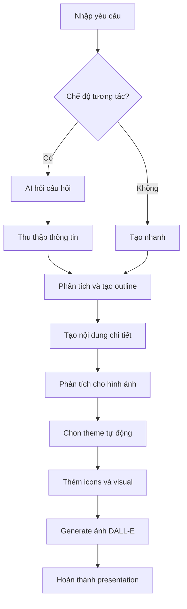

# 🎓 Enhanced AI PowerPoint Generator

## Tổng quan
Enhanced AI PowerPoint Generator là một ứng dụng thông minh sử dụng ChatGPT và DALL-E để tạo ra các bài thuyết trình PowerPoint chuyên nghiệp với khả năng **tương tác**, **tạo hình ảnh tự động** và **chọn theme thông minh**.

## ✨ Tính năng nâng cao

### 🗣️ Tương tác thông minh
- **Hỏi đáp tự động**: AI hỏi câu hỏi để hiểu rõ nhu cầu
- **Thu thập thông tin**: Xác định đối tượng, thời gian, mức độ chi tiết
- **Tùy chỉnh style**: Chọn phong cách trình bày phù hợp
- **Theo dõi tiến độ**: Hiển thị quá trình tạo presentation

### 🎨 Tạo hình ảnh tự động  
- **Phân tích nội dung**: AI xác định slides cần hình ảnh minh họa
- **DALL-E integration**: Tự động tạo ảnh phù hợp với từng slide
- **Ưu tiên thông minh**: Ưu tiên tạo ảnh cho slides quan trọng
- **Concepts thông minh**: Tạo prompt phù hợp với môn học và chủ đề

### 🎯 Theme thông minh
- **Tự động chọn theme**: AI phân tích nội dung để chọn theme phù hợp
- **Nhiều template**: Education, Business, Tech, Creative themes
- **Icons tự động**: Thêm icons phù hợp cho từng slide
- **Color schemes**: Bảng màu chuyên nghiệp

### 📊 Phân tích và tối ưu
- **Cấu trúc logic**: Tạo outline có tính thuyết phục
- **Thời gian hợp lý**: Ước tính thời gian cho từng slide
- **Nội dung phù hợp**: Điều chỉnh theo đối tượng và mức độ
- **Visual elements**: Thêm biểu tượng và elements phù hợp

## 🚀 Hướng dẫn sử dụng

### Bước 1: Khởi động ứng dụng
```bash
streamlit run main.py
```

### Bước 2: Cấu hình API Keys
1. Nhập **OpenAI API Key** trong sidebar
2. Chọn model GPT (gpt-3.5-turbo hoặc gpt-4)
3. Bật/tắt các tính năng:
   - 🗣️ Chế độ tương tác
   - 🖼️ Tự động tạo ảnh DALL-E
   - 🎯 Tự động chọn theme

### Bước 3: Tạo presentation (Chế độ tương tác)
1. **Nhập yêu cầu ban đầu**: 
   ```
   "Tạo bài giảng Sinh học lớp 10 về cấu trúc tế bào"
   ```

2. **Trả lời câu hỏi AI**:
   - Đối tượng khán giả
   - Thời gian trình bày
   - Mức độ chi tiết
   - Style ưa thích

3. **AI tự động**:
   - Phân tích nội dung để tạo hình ảnh
   - Chọn theme phù hợp
   - Tạo icons và visual elements
   - Generate ảnh DALL-E

### Bước 4: Xem và tùy chỉnh
- **Tab Preview**: Xem trước toàn bộ presentation
- **Tab Customize**: Chọn theme, chỉnh sửa nội dung
- **Tab Download**: Tải xuống PowerPoint, JSON hoặc xem ảnh

## 🎨 Hệ thống Theme

### Education Pro
- **Màu sắc**: Ocean Blue, Magenta, Orange
- **Phù hợp**: Giáo dục, training, học thuật
- **Font**: Calibri family

### Tech Gradient  
- **Màu sắc**: Blue Purple gradient
- **Phù hợp**: Công nghệ, lập trình, AI
- **Font**: Arial family

### Business Elegant
- **Màu sắc**: Deep Blue, Orange professional
- **Phù hợp**: Doanh nghiệp, corporate
- **Font**: Times New Roman

### Creative Vibrant
- **Màu sắc**: Pink, Purple, Cyan
- **Phù hợp**: Sáng tạo, marketing, design
- **Font**: Comic Sans MS

## 🖼️ Hệ thống tạo ảnh

### Phân tích thông minh
- **High Priority**: Slides có keywords về cấu trúc, mô hình, sơ đồ
- **Medium Priority**: Slides khoa học, kỹ thuật
- **Auto Detection**: Tự động phát hiện môn học và tạo prompt phù hợp

### Subjects hỗ trợ
- 🧬 **Sinh học**: Cell structure, DNA, proteins
- ⚛️ **Vật lý**: Light, electricity, energy
- ⚗️ **Hóa học**: Reactions, atoms, molecules  
- 📐 **Toán học**: Geometry, graphs, equations
- 💼 **Business**: Digital marketing, strategy
- 💻 **Tech**: Programming, algorithms, data

## 📊 Luồng hoạt động



## 🛠️ Cài đặt và yêu cầu

### Yêu cầu hệ thống
```
Python 3.8+
Streamlit
OpenAI API
python-pptx
Pillow
```

### Cài đặt dependencies
```bash
pip install -r requirements.txt
```

### File requirements.txt
```
streamlit>=1.28.0
openai>=0.28.0
python-pptx>=0.6.21
Pillow>=10.0.0
requests>=2.31.0
```

## 📁 Cấu trúc project

```
duan_pp/
├── main.py                    # Enhanced Streamlit app
├── ai_content_generator.py    # Enhanced AI generator với tương tác
├── dalle_generator.py         # DALL-E image generation
├── theme_system.py           # Modern theme system
├── powerpoint_generator.py   # PowerPoint file generation
├── requirements.txt          # Dependencies
├── README.md                 # Documentation
└── dalle_images/            # Generated images storage
```

## 🔧 Tùy chỉnh nâng cao

### Thêm theme mới
```python
# Trong theme_system.py
"custom_theme": {
    "name": "Custom Theme",
    "colors": {
        "primary": "#your_color",
        "secondary": "#your_color"
    },
    "fonts": {
        "title": {"size": 36, "family": "Arial"}
    }
}
```

### Tùy chỉnh DALL-E prompts
```python
# Trong dalle_generator.py
def _create_image_prompt(self, slide_title, topic):
    # Thêm logic custom cho domain cụ thể
    if "your_domain" in topic.lower():
        return "your custom prompt"
```

## 🎯 Use Cases

### Giáo dục
- **Bài giảng các môn học**: Toán, Lý, Hóa, Sinh, Sử, Địa
- **Giáo án điện tử**: Cấu trúc bài học, mục tiêu, hoạt động
- **Training materials**: Đào tạo giáo viên, workshop

### Doanh nghiệp
- **Business presentations**: Kế hoạch kinh doanh, báo cáo
- **Marketing materials**: Chiến lược digital, campaigns
- **Training nội bộ**: Onboarding, skill development

### Học thuật & Nghiên cứu
- **Conference presentations**: Research findings
- **Thesis defense**: Luận văn, luận án
- **Academic lectures**: Đại học, sau đại học

## 🚨 Lưu ý quan trọng

### API Costs
- **ChatGPT**: ~$0.002/1K tokens (gpt-3.5-turbo)
- **DALL-E**: ~$0.020/image (1024x1024)
- **Ước tính**: 1 presentation = $0.10-0.50

### Giới hạn
- **Slides**: Tối ưu cho 5-15 slides
- **Images**: Tối đa 10 ảnh/presentation  
- **Content**: Phù hợp với mô hình ngôn ngữ

### Bảo mật
- API keys được lưu local trong session
- Không upload dữ liệu lên server
- Generated images lưu tạm local

## 🤝 Đóng góp

### Báo lỗi
- Tạo issue trên GitHub với mô tả chi tiết
- Bao gồm logs và steps reproduce

### Feature requests
- Đề xuất tính năng mới qua GitHub issues
- Mô tả use case và lợi ích

### Development
```bash
# Fork repository
# Tạo feature branch
git checkout -b feature/amazing-feature

# Commit changes
git commit -m "Add amazing feature"

# Push và tạo Pull Request
```

## 📞 Hỗ trợ

### Documentation
- README.md (file này)
- Code comments trong từng module
- Docstrings cho các functions

### Community
- GitHub Issues cho bugs và features
- Wiki cho guides chi tiết

## 🔮 Tính năng tương lai

### Version 2.0 (Planned)
- 🎬 **Animation support**: Transition effects
- 🗣️ **Voice narration**: Text-to-speech integration  
- 📱 **Mobile responsive**: Responsive design
- 🌐 **Multi-language**: Support English, Chinese
- 📊 **Advanced charts**: Data visualization
- 🤖 **AI editing**: Intelligent content optimization

### Version 2.1 (Wishlist)
- 🎥 **Video integration**: Embedded videos
- 📈 **Analytics**: Presentation effectiveness metrics
- 🔄 **Version control**: Track changes, rollback
- 👥 **Collaboration**: Multi-user editing
- ☁️ **Cloud sync**: Save to cloud storage

## 📜 License

MIT License - Xem file LICENSE để biết chi tiết.

## 🙏 Acknowledgments

- **OpenAI**: ChatGPT và DALL-E APIs
- **Streamlit**: Web framework tuyệt vời
- **python-pptx**: PowerPoint generation library
- **Community**: Contributors và feedback

---

**Made with ❤️ for better presentations**

*Tạo presentation chưa bao giờ dễ dàng và thông minh đến thế!* 